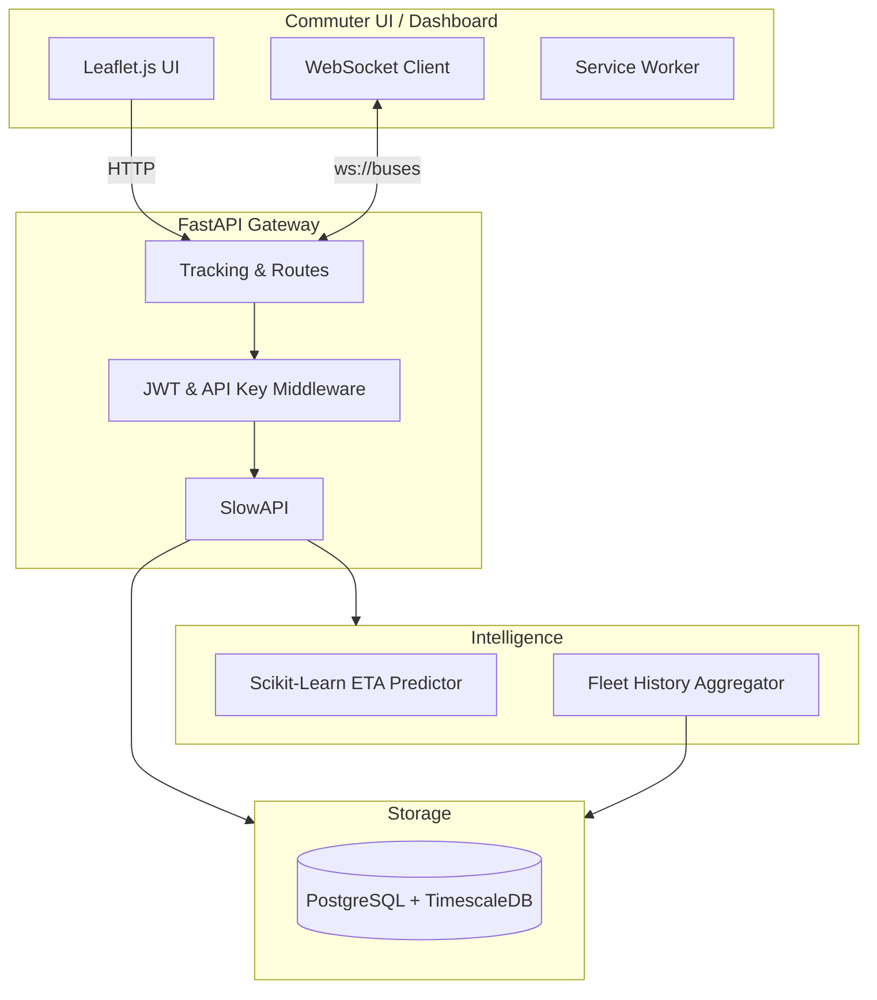

# Smart-Transit Enterprise 🚌✨


An enterprise-grade, real-time public transit tracking system. Built with a modular Python/FastAPI backend, TimescaleDB for high-volume time-series data, and a responsive vanilla JavaScript + Leaflet.js frontend.

## 🌟 Features

*   **Real-time GPS Tracking:** WebSocket-powered live bus tracking (`/ws/buses`).
*   **ML ETA Prediction:** Integrated scikit-learn `GradientBoostingRegressor` model predicting arrival times based on distance and dynamic speeds.
*   **Security & Auth:** JWT role-based access for admins and API Key authentication for telemetry ingestion endpoints.
*   **Fleet Analytics:** Historical route performance and hourly telemetry data leveraging TimescaleDB aggregation.
*   **Progressive Web App (PWA):** Installable, cached offline capabilities for commuter tracking.
*   **Cloud Native:** Dockerized, CI/CD pipeline integrated, and ready for deployment to platforms like Railway.

---

## 🏗 Architecture



---

## 🚀 Quick Start (Local Development)

### 1. Requirements
*   Python 3.10+
*   Docker & Docker Compose

### 2. Environment Setup
Copy the environment template and adjust values if needed:
```bash
cp .env.example .env
```

### 3. Launch Database
Start TimescaleDB on port 5433:
```bash
docker-compose up -d
```

### 4. Install Dependencies & Initialize
```bash
pip install -r requirements.txt
python scripts/setup_tables.py
python scripts/init_db_data.py
```

### 5. Run Server
```bash
uvicorn backend.app.main:app --host 0.0.0.0 --port 8000 --reload
```
The frontend is served directly by the API. Visit [http://localhost:8000](http://localhost:8000).

### 6. Start Simulator
In a new terminal, simulate live bus telemetry:
```bash
python simulation/bus_simulator.py
```

---

## 📚 API Reference

**Auth Endpoints:**
*   `POST /auth/token` - Get JWT admin token

**Tracking & ETA:**
*   `GET /eta?distance_meters=X&current_speed_kmh=Y` - Get ML prediction
*   `GET /buses/live` - Polling alternative to WebSockets
*   `POST /location` - (Requires `X-API-Key`) Ingest bus GPS ping
*   `WS /ws/buses` - Real-time stream of bus positions

**Analytics (Requires JWT):**
*   `GET /analytics/fleet/summary`
*   `GET /analytics/fleet/hourly`
*   `GET /analytics/bus/{id}/history`
*   `GET /analytics/routes/performance`

**Admin CRUD (Requires JWT):**
*   `POST /admin/routes`
*   `DELETE /admin/routes/{route_id}`

Check `http://localhost:8000/docs` for the interactive Swagger UI.

---

## 🧪 Testing

The repository includes a comprehensive `pytest` integration test suite.
```bash
python -m pytest tests/ -v
```

---

## 📝 License
This project is licensed under the MIT License.
